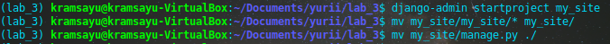
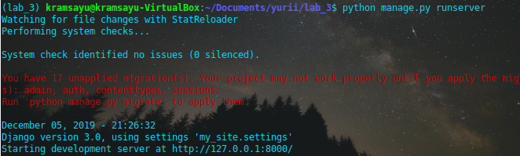
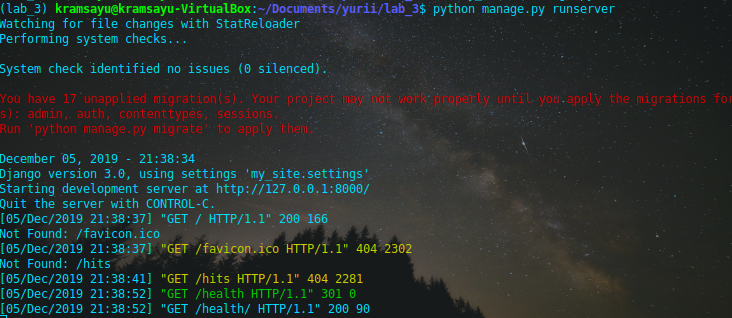
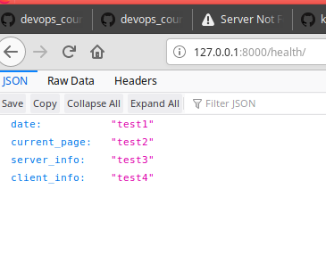

# Lab_3: Вступ до моніторингу.

## Pre-requirements:
- середовище з інстальованим Python / pip / pipenv;
- будь-який WEB-браузер;

## хід роботи
1. Створено папку з назвою лабораторної (lab_3). Ініціалізовано середовище pipenv. Встановлено необхідні пакети (django)
2. Створено django-template з назвою `my_site`. Винесено файли на рівень вище.
- 
3. Запустив сервер django:
- 
4. створив коміт з базовим темплейтом. Файл `db.sqlite3` не комітив додавши його до `.gitignore`.
5. створив template додатку (main). Створив коміт.
6. Створив папку `main/templates` та в ній створив файл `main.html`. створив файл `main/urls.py`. зробив коміт.
7. Вказав назву додатку в файлі налаштувань - `my_site/settings.py`. вніс зміни у файл `my_site/urls.py`.
8. Ознайомився з вмістом `main/views.py`
9. Заповнив файл `main/urls.py` за зразком.
10. Запустив сервер:
- 
- 
11. Встановив бібліотеку `requests` та додав файл `monitoring.py`
12. Див. п. 10
13. Захист:
- Модифікував функцію `health`, щоб у відповідь генерувалась дата, адреса сторінки, інфо. про сервер та інфо. про клієнта.
- дописав програму моніторингу так, щоб при недоступності сайту виводилось повідомлення.
- зробив щоб програма моніторингу запускалась у фоні кожну хвилину
- додав швидкий виклик команди моніторингу у файл `Pipfile` у розділ `scripts`. Швидкий виклик: `pipenv run mn`
14. Запустив сервер та програму моніторингу в різних вікнах. Закомітив файл логів `server.logs`